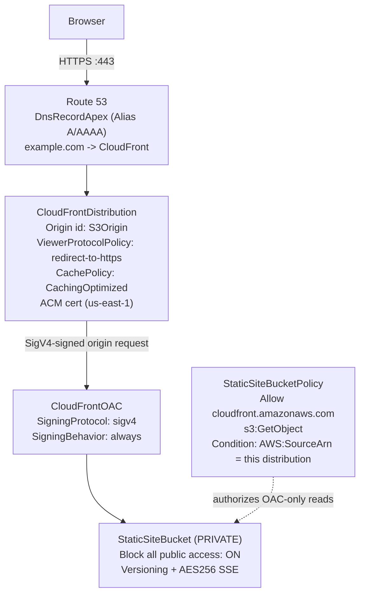
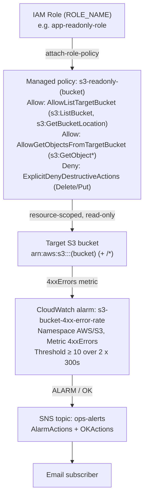

# AWS Cloud Projects

Two hands-on labs demonstrating core AWS skills: hosting a secure static website and implementing least-privilege IAM with operational monitoring.

## Architecture

The diagrams below render natively on GitHub and reflect the actual resources defined in this repo's CloudFormation template, policy documents, and deploy scripts.

### Lab 1 — Static Site: S3 (private) + CloudFront over HTTPS via OAC

The S3 bucket is never public. The viewer reaches CloudFront over HTTPS (TLS enforced by the ACM cert), and CloudFront is the *only* principal allowed to read the bucket — authenticated with a SigV4-signed request through Origin Access Control.



### Lab 2 — IAM least-privilege role + CloudWatch alarm to SNS

A managed policy (`s3-readonly-<bucket>`) scoped to one bucket is attached to an existing role. Access control and observability are paired: a CloudWatch alarm watches the bucket's 4xx error rate and notifies an SNS topic when access starts failing.



## Why These Projects

Hiring managers want to see that you understand *why* AWS services are wired together the way they are, not just that you can click through the console. These labs were built to practice cloud fundamentals that show up in every IT/sysadmin/cloud role:

- **Serving content securely at the edge** — S3 + CloudFront + ACM
- **Controlling access tightly** — IAM least privilege
- **Knowing when things break** — CloudWatch alarms

---

## Project 1: Static Website on S3 + CloudFront + Route 53 + ACM

**Directory:** `static-site/`

### What It Does

Serves a static website globally via CloudFront CDN with HTTPS enforced, a custom domain managed in Route 53, and an ACM-issued TLS certificate — no web servers to patch, no compute costs.

### Architecture

```
 Browser
   |
   v
 Route 53 (DNS: example.com → CloudFront)
   |
   v
 CloudFront Distribution
  - HTTPS only (ACM certificate)
  - Origin: S3 bucket (private, no public access)
  - Origin Access Control (OAC) — CloudFront-only access to S3
   |
   v
 S3 Bucket (private)
  - Static assets (HTML/CSS/JS)
  - Versioning enabled
  - Server-side encryption (AES-256)
```

### What It Taught

| Concept | Why It Matters |
|---|---|
| S3 bucket policy with OAC | Keeps the bucket private; only CloudFront can read it — eliminates direct-access data exposure |
| ACM certificate in us-east-1 | CloudFront requires certs in us-east-1 regardless of where your content lives |
| Route 53 Alias record | Alias records are free (vs. CNAME) and required for zone apex (example.com, not www) |
| CloudFront cache behaviors | Controls TTL, compression, and HTTPS redirect at the CDN layer, not the origin |
| CloudFormation IaC | Reproducible — tear down and redeploy in minutes; no console drift |

---

## Project 2: IAM Least-Privilege + CloudWatch Monitoring

**Directory:** `iam-least-privilege/`

### What It Does

Defines a minimal IAM policy that grants read-only access to a specific S3 bucket (and nothing else), then sets up a CloudWatch alarm to alert on elevated S3 error rates — proving that access control and observability go hand in hand.

### Architecture

```
IAM Role (attached to EC2 / Lambda / service)
  - Policy: s3:GetObject + s3:ListBucket on ONE bucket only
  - No wildcard resources, no write permissions
  - Explicit Deny on s3:DeleteObject (defense in depth)

CloudWatch
  - Metric filter on CloudTrail logs → S3 4xx errors
  - Alarm → SNS Topic → Email notification
```

### What It Taught

| Concept | Why It Matters |
|---|---|
| Resource-scoped ARNs | `arn:aws:s3:::my-bucket/*` vs `*` — principle of least privilege in practice |
| Explicit Deny | Overrides any Allow from other attached policies; belt-and-suspenders for destructive actions |
| Conditions in IAM | Restrict by IP, MFA, or time — policies are more expressive than most people realize |
| CloudWatch metric filters | Turns log data into actionable signals without a third-party SIEM |
| SNS alarm notifications | Ops loop closed — if something breaks, a human hears about it |

---

## Skills Demonstrated

`AWS S3` `CloudFront` `Route 53` `ACM` `IAM` `CloudWatch` `SNS` `CloudFormation` `Least Privilege` `Infrastructure-as-Code` `TLS/HTTPS` `DNS`

## Certifications Relevant to This Work

- AWS Certified Cloud Practitioner
- CompTIA Security+
- CompTIA Network+
- CompTIA A+
